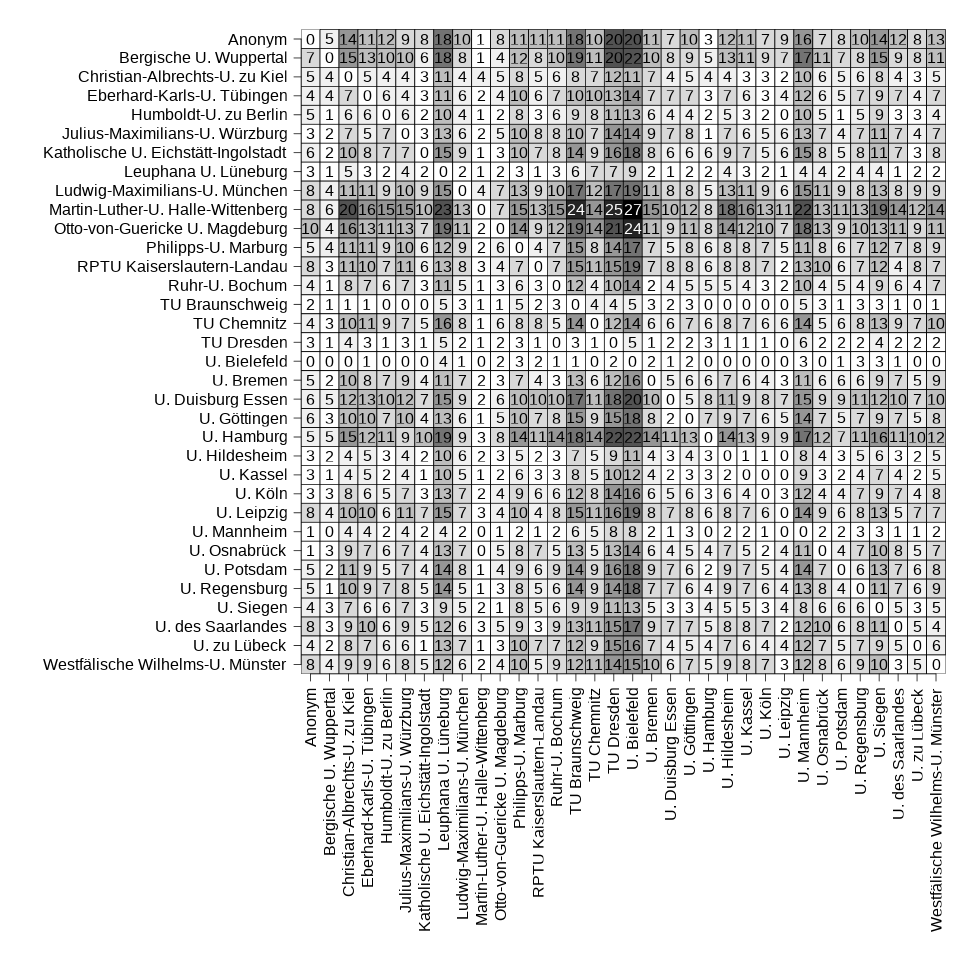

This repository accompanies the paper Sternkopf, Lungwitz, Zapke, & Titz. *Einheitlich oder divers: Die Methodenlehre im Bachelor-Psychologiestudium an deutschen Universitäten*

## preparation

I use librarian for library management, please install or modify to use library

```{r}
librarian::shelf(plot.matrix, reshape2, knitr)
```

##  use of stats software

```{r}
software <- read.csv2("software.csv")

kable(sort(colSums(software[, -1], na.rm = T), decreasing = T))
```

## topics covered

table 1

```{r}
d <- read.csv2("topics.csv", row.names = 1)
row.names(d)[1] <- "Anonym"
d <- d[, order(names(d))]
kable(sort(colSums(d), decreasing = T))
```

## distance matrix

```{r}
# all pairs for comparisons
pairs <- expand.grid(rownames(d), rownames(d))

# find all 01 patterns (row 0, col 1)
comps <- unlist(Map(\(x, y) table(paste0(d[x, ], d[y, ]))["01"],
                    pairs[, 1],
                    pairs[, 2]))

pairs <- cbind(pairs, value = comps)
pairs[is.na(pairs)] <- 0

# reshape into matrix
mtrx <- acast(pairs, Var1 ~ Var2, value.var = "value")
```

make function for plot for different formats:

```{r}
theplot <- function() {
  par(mar=c(5.1, 5.1, 0.5, 0.5)*4.1)
  plot(
       mtrx,
       fmt.cell = "%.0f",
       main = "",
       xlab = "",
       ylab = "",
       key = NULL,
       #col = gray.colors(10, start = 0, end = 1),
       col = RColorBrewer::brewer.pal(max(mtrx), "Greys"),
       na.col = "black",
       axis.col = list(side=1, las=2),
       axis.row = list(side=2, las=1)
  )
}
```

save plots:

```{r}
png("distances.png", width = 15*65, height = 15*65)
theplot()
dev.off()

setEPS()
postscript("distances.eps", width = 15*0.9, height = 15*0.9)
theplot()
dev.off()

```

plot:


